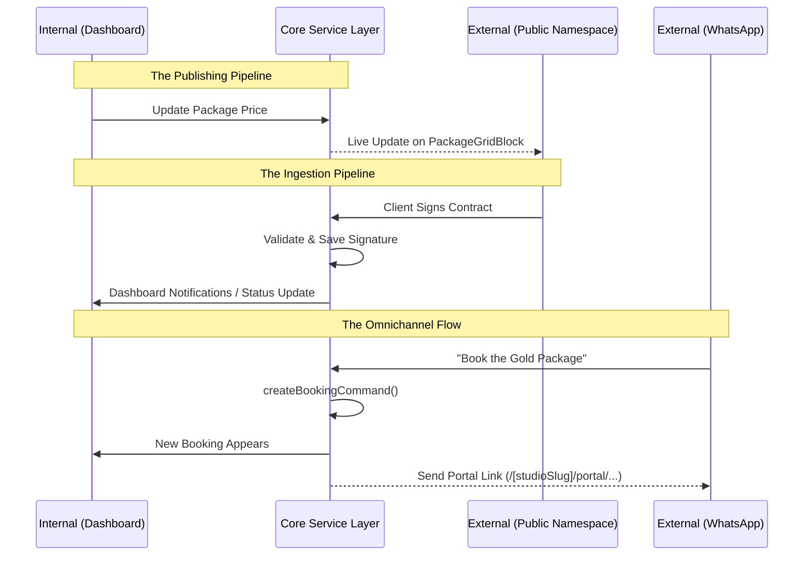

# The Symbiosis: Internal vs External Architecture

The most powerful aspect of the Studio OS is not the dashboard or the storefront in isolation, but how they feed into each other. We have designed a **bi-directional data flywheel**. Here is how the internal operations and external experiences communicate.

## 1. Internal ➔ External (The Publishing Pipeline)

The Dashboard is where the business lives, but it must safely project data into the Public Namespace. This is strictly governed by the **Data Membrane** principle.

**The Flow:**
1. **Operational Input**: A photographer creates a new Package and a new Gallery in the Dashboard (`app/(dashboard)`).
2. **The Bouncer (DTO Layer)**: The Data Access Layer (`lib/domains/public/services.ts`) queries the raw database. It strips out sensitive operational data (like internal margins or draft statuses) and creates a safe `PublicStorefrontDTO`.
3. **The Layout Engine**: The Universal Builder configuration (`layouts` table) defines *where* things should go.
4. **The Public Projection**: The Storefront (`app/(public)/[studioSlug]/page.tsx`) renders the layout and injects the DTOs into the Ecosystem Blocks (e.g., `PackageGridBlock`, `GalleryPortfolioBlock`).

**Why it’s powerful:** 
The photographer never touches a "Website Editor" to update prices. They run their business internally, and the external architecture perfectly reflects it in real-time.

---

## 2. External ➔ Internal (The Ingestion Pipeline)

The Public Namespace is where the client lives. Every client action must securely mutate the internal state without exposing the underlying database.

**The Flow:**
1. **Client Action**: A client views their portal (`/[studioSlug]/portal/summary/[id]`), signs a Contract, or clicks "Book" on a package.
2. **Server Actions (The Bridge)**: The React component fires a Server Action (e.g., `acceptContract` in `app/actions/contracts.ts`).
3. **Validation & Idempotency**: The Business Logic layer ensures the signature is valid and the contract hasn't already been signed (preventing double-execution).
4. **Database Mutation**: The Data Access Layer executes the raw SQL/PostgREST to update the database.
5. **Event Orchestration**: Once the database saves successfully, an Orchestrator (`app/actions/orchestrators.ts`) runs side effects: sending a confirmation email to the client, notifying the photographer, and updating the internal dashboard's "Recent Activity" widget.

**Why it’s powerful:** 
Client inputs are treated as untrusted events until they pass through the strict business logic layer, keeping the internal database pristine.

---

## 3. The Omnichannel Strategy (The Third Player)

Because we enforced the **Ports and Adapters** architecture, the Internal and External architectures are completely decoupled. This allows a third entity to enter the ecosystem seamlessly: **WhatsApp (or any external API)**.

**The Flow:**
1. **WhatsApp Input**: A client sends a message: "I want to book the Gold Package for tomorrow."
2. **The Webhook adapter**: The incoming webhook hits an API route (`app/api/whatsapp`).
3. **The Shared Commands**: The webhook formats the data and calls the exact same `createBookingCommand()` function that the Storefront uses.
4. **Internal State Updates**: The booking appears in the Dashboard.
5. **External Link Generation**: The system generates a secure Portal Link (`/[studioSlug]/portal/summary/[id]`) and texts it back to the client via WhatsApp so they can pay the deposit.

## Visualizing the Data Flow

## Summary
The system acts as a central brain (`Core Service Layer`). The Internal Dashboard is simply a highly-privileged visual interface to manage that brain. The External Storefront is a read-only projection of that brain combined with secure input forms. 

Because they both rely on the same underlying Service Layer, the ecosystem is in perfect harmony.
